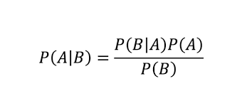

# Bayesian Classifier
<br>
This is a program that takes an input and tries it's best to determine if the input is negative or positive.<br>
Accuracy is now 89.7% which is quite good. Dataset size approx 2000 reviews in total.<br>
<br>
The dataset used is not my own and belongs to the Association of Computational Linguistics (ACL), 2007<br>
<br>
More detailed readme also coming up!<br>
This is a ongoing part-time project so it might take a while to update this.<br>
<br>

## Bayesian What?
In statistics, Naive Bayes classifiers are a family of simple "probabilistic classifiers" based on applying Bayes' theorem with strong (naïve) independence assumptions between the features.<br>



Where:<br>
* A is our word.<br>
* B is the either positive or negative.<br><br>


In short, this program takes a string and tries to determine if it is positive or negative, based on probability. For each word in a sentence, it calculates the probability of the word being positive or negative. And the highest probability wins.<br>
The naive part is the assumption that each word is examined as an independent probability.<br>

This is a supervised machine learning model.<br>
Supervised means that it will not learn on it's own, it can only learn by data it has been fitted to.<br>
This classifier is based on electronics reviews from amazon.<br>

## Improvements
BIG: Training & testing data should not be single words. Fitted data should be sentences.<br>
* This should make the accuracy far more better.<br>
* Deployed: accuracy improved from 54% to 89.7%<br>
Maybe binomial approach (Single word bad, 2 word sequence good?)<br>
Dataset improvements, is there a better one?<br>
Language processing:<br>
* Better regexing or parsing.<br>
* Better lemmatization. (with tags?)<br>

## Setup
You will need python3
```
$ pip install python3
```

And NLTK and nltk.wordnet
```
$ pip3 install nltk
$ python3
>>> import nltk
>>> nltk.download("wordnet")
```

And scikit-learn
```
$ pip3 install scikit
```
